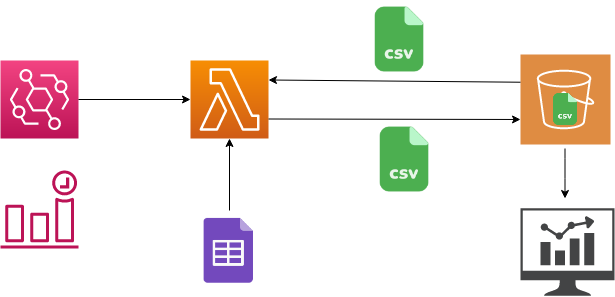

# CPS-COVID README:
Dashboard for tracking reported COVID-19 cases at Chicago Public Schools

## Project Intro

This is the back-end of the Chicago Public Schools Covid tracking website found at [cpscovid.com](https://cpscovid.com).

The purpose is to automate the ingesting and updating of the dataset used for display by the front end. 

At midnight local time (6am UMT) an [EventBridge](https://aws.amazon.com/eventbridge/) scheduled event triggers a [Lambda](https://aws.amazon.com/lambda/) function. This function pulls a public Google Sheet ([link](https://docs.google.com/spreadsheets/d/1dMtr8hhhKjPyyNg7i6V52iMQXEqa67E9iAmECeOqZ6c)) maintained by Chicago Public Schools with current totals of cases for each school for students and staff who were present in that District run (read: not a charter etc.) school. This document is updated AFTER potenitally exposed individuals in the building and classroom are notified, so data may lag slightly behind reality. 

The function also pulls a csv file containing all the school's totals, previous daily counts, and location data for each school.

Both of these files (historical data and new data) are loaded into a [pandas](https://pandas.pydata.org/) dataframe and evaluated. A new column is added to the historical data containing the new cases at each school (historical total - new total) and then the historical total is updated to reflect the new total. The now up-to-date 'historical data' is exported as a .csv and placed back in the S3 bucket used by the front-end. 

<!-- The repository for the front end can be found [here]() -->

## Technology stack: 
  
The project is built with the [AWS Serverless Application Model (SAM)](https://aws.amazon.com/serverless/sam/) and consists primarily of a `template.yaml` file that describes the deployed archetecture, and an `app.py` file that outlines the function that will run on AWS lambda. Once build and deployed to AWS, the function, IAM roles, EventBridge schedule, etc. are configured and become real infrastructure.

The function, written in python, uses the pandas framework to update 'yesterday's' dataset with the new totals that are published by the school district.

Once the dataset is updated, it is saved as the same file in a versioned S3 bucket.

## Status:  
- MVP.

## Known issues/technical debt
- Set up to only parse for updates to the second quarter of school year 21 (Q2 ST21) which ends Feb4. Will need to pay off by then.
- Schools are sorted in order and logic is not added to ensure that number comparisons are done between schools with equal name values.

## TODO
- Support for more informative popouts ie. School histogram might need to fetch a dataset containing running 7 or 14 day averages, weekly summaries etc.
- Pay off tech debt.
- Depends on requirements from front-end.

## Contact
- http://www.jakobondrey.com

----

## Credits and references

1. [CPS Dataset](https://www.cps.edu/school-reopening-2020/)
    -   [-Data-](https://docs.google.com/spreadsheets/d/1dMtr8hhhKjPyyNg7i6V52iMQXEqa67E9iAmECeOqZ6c)
2. [School Loaction Dataset](https://catalog.data.gov/organization/86c0c3d9-3826-47ab-a773-6924b858dd04?groups=local&tags=cps) 
    - [-Data-](https://data.cityofchicago.org/api/views/d2h8-2upd/rows.csv?accessType=DOWNLOAD)
3. [SAM](https://aws.amazon.com/serverless/sam/)
4. [pandas](https://pandas.pydata.org/)
